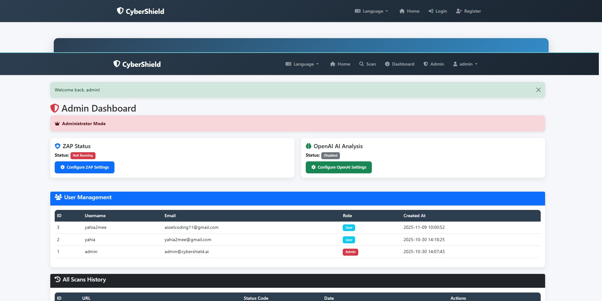

# CyberShieldAI

CyberShieldAI is a Flask-based web platform for practical web-application security assessment. It combines lightweight HTTP security checks, optional OWASP ZAP integration, AI-assisted analysis, PDF reporting, bilingual UI support, and administrative controls.



## Highlights

- User authentication and role-aware dashboards
- Fast HTTP checks for security headers and response behavior
- OWASP ZAP integration for deeper security scanning
- Optional OpenAI-assisted analysis of scan results
- Downloadable PDF security reports
- Arabic / English interface support
- Admin controls for users, scans, ZAP, and OpenAI settings
- SQLite-backed local persistence

## Tech Stack

- Python
- Flask
- Flask-Login
- SQLite
- OWASP ZAP
- OpenAI API
- ReportLab / FPDF
- scikit-learn
- pandas
- NumPy

## Installation

```bash
git clone https://github.com/yahiamee/CyberShieldAI.git
cd CyberShieldAI

python -m venv .venv
```

### Windows

```bash
.venv\Scripts\activate
pip install -r requirements.txt
set SECRET_KEY=replace-with-a-secure-value
python app.py
```

### Linux / macOS

```bash
source .venv/bin/activate
pip install -r requirements.txt
export SECRET_KEY=replace-with-a-secure-value
python app.py
```

By default, the application runs on:

```text
http://0.0.0.0:5000
```

## Project Structure

```text
app.py                     Application entry point
database.py                SQLite initialization and persistence
models/report_generator.py PDF report generation
templates/                 HTML templates
static/style.css           Main styling
reports/                   Generated scan reports
zap_manager.py             OWASP ZAP integration
openai_analyzer.py         OpenAI-assisted analysis
translations.py            Arabic / English localization
```

## Security Notes

For production deployments:

- Keep `SECRET_KEY` outside source control.
- Store API credentials in environment variables.
- Restrict OWASP ZAP access to trusted environments.
- Place the application behind a production web server and TLS.
- Review generated security findings before acting on automated recommendations.

## Contributors

- Eng. Yahia Hayder
- Mohammed Alomar
- Talal Alomar
- Mohammed Qahhat
- Sayyad Alhareth
- Mohammed Ali

## Disclaimer

Use security scanning tools only against systems you own or have explicit authorization to test.
